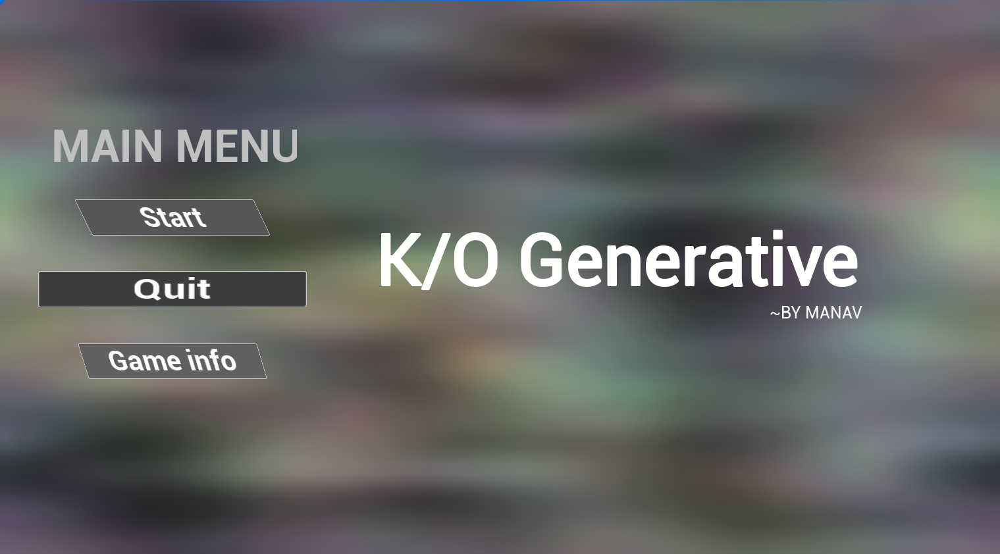
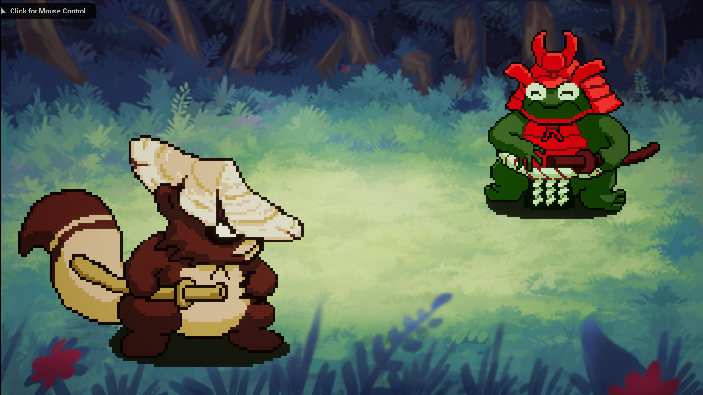
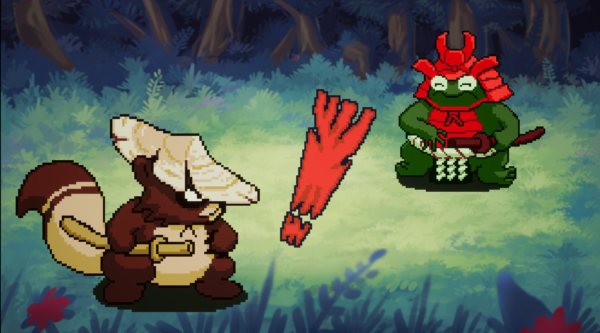

# Generate K/O Game

Welcome to the Generative K/O game repository! This repository contains the source code and assets for the game.

## About the Game
Generative K/O is a fun and exciting game built in Unreal Engine. Unfortunately, we haven't included the APK file for this game in this repository. However, we've provided a video and screenshots to give you a glimpse of the gameplay.

## Screenshots
Here are some screenshots from the game:

## Gameplay Video
To see the game in action, check out the gameplay video on YouTube:

[Generate K/O Video](video/"2023-10-10 22-29-33.mp4")

Please note that this video provides an overview of the game, but you won't be able to play it directly from this repository without the APK file.

## Getting Started
If you're interested in exploring the source code or contributing to this project, you can follow these steps:

1. Clone the repository:
